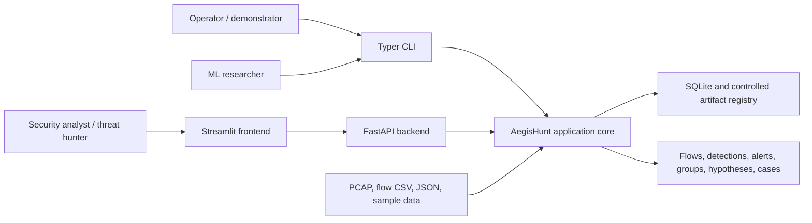
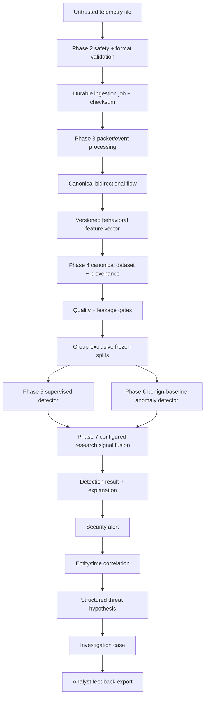

# Architecture

## Status and scope

This document defines the target architecture and its phased realization. Phase
3 provides bounded packet decoding, canonical bidirectional aggregation,
deterministic feature schema `1.0.0`, and transactional `NetworkFlow`
persistence. Phase 4 adds file-based dataset registry, canonical transformation,
quality/leakage gates, and group-exclusive frozen splits. Phase 5 adds supervised
candidate training, validation-frozen selection, one-time test evaluation, safe
bundles, and strict prediction. Phase 6 adds benign-only Isolation Forest,
novelty-mode LOF comparison, score normalization, validation-selected threshold,
one-time anomaly test, and safe anomaly bundles. Phase 7 adds configured
dual-engine score fusion, validation-frozen policy selection, isolated robustness
experiments, group-bootstrap evidence, and a JSON-only policy artifact. Detection
results, configured risk/severity, threshold-gated alerts, non-causal
explanations, and audited verdicts are implemented in Phase 8. Correlation,
hunting workflows, cases, PCAP replay orchestration, and runtime workers remain
planned.

## System context

Users interact through the CLI, HTTP API, or frontend. Offline inputs are the
default operational boundary. The system does not require a live target or an
external model service.

## Modular-monolith structure

One deployable Python application is divided by responsibility:

| Module boundary | Planned responsibility | First owning phase |
| --- | --- | --- |
| `config`, schemas, storage | Implemented settings, entity contracts, repositories, audit | 1 |
| ingestion | Implemented safe adapters, storage, samples, and ingestion jobs | 2 |
| flows, features | Implemented packet state, timeouts, finalization, and feature registry | 3 |
| datasets | Implemented registry, conversion, split, manifests, leakage and quality | 4 |
| ML supervised | Implemented group-CV, validation selection, bundles, prediction | 5 |
| ML anomaly | Implemented benign fit, normalization, validation threshold, bundle | 6 |
| ML fusion/evaluation | Implemented validation-selected research fusion and comparisons | 7 |
| detection and explainability | Results, risk, alerts, reasons, explanations | 8 |
| correlation and hunting | Entity/time groups and deterministic hypotheses | 9 |
| cases and feedback | Investigation workflow and retraining candidates | 10 |
| runtime | Pipeline, worker, replay, health, graceful shutdown | 11 |
| API and frontend | Complete external workflows and sample demonstration | 12 |

Domain modules must not depend on Streamlit. FastAPI routes and the CLI call
application services; repositories isolate persistence; adapters isolate file,
packet, model, and UI concerns. This keeps unit testing possible without running
the whole application.

## Planned data flow

The boundary through `Supervised` and `Anomaly` is implemented for supported PCAP-derived
features and the controlled demo. Public benchmark acquisition and label joining
remain manual/provisional gates, so current model metrics verify the pipeline
only. The Fusion node is implemented for the Phase 7 controlled experiment;
Detection and every downstream node remain planned. IDs and provenance are
preserved; raw evidence, labels, supervised probability, normalized anomaly
score, experimental fusion score, future detection, correlation, and analyst
judgment remain distinguishable.

## Dataset lifecycle

```mermaid
flowchart LR
    Registry["Static dataset + license registry"] --> Acquire["Manual/explicit acquisition"]
    Acquire --> Raw["Configured raw root + SHA-256"]
    Raw --> Convert["Versioned exact-schema converter"]
    Convert --> Canonical["Metadata | ordered features | labels"]
    Canonical --> Quality["Schema, missing, duplicate, range, class checks"]
    Quality --> GroupSplit["Seeded whole-group split"]
    GroupSplit --> Leakage["Cross-split and label leakage gate"]
    Leakage --> Manifests["Frozen manifests + CSV/JSON reports"]
```

Static provider facts are separate from machine-local state. Raw files are never
overwritten. The canonical feature section exactly matches the Phase 3 43-field
tuple; source, capture, scenario, group, timestamp, IDs, labels, and checksums
remain metadata. Missing or semantically unmatched public features are rejected,
not imputed or fabricated. CSE-CIC-IDS2018 is the conditional primary candidate,
while the offline controlled demo validates the machinery without representing
real traffic.

Public rows also carry an operator-recorded source access date. Public manifests
derive raw filenames/checksums from canonical provenance, enforce registry
dataset/version and conversion-state gates, and never substitute traffic
observation time for acquisition time.

The splitter refuses fewer than three groups and any source/session/scenario
identity shared by multiple groups. It never falls back to random rows. Quality
and leakage reports must pass before a final dataset manifest is written. Test
is marked frozen and prohibited for future model/threshold/feature selection.

## ML lifecycle

```mermaid
flowchart LR
    Sources["Versioned source data"] --> Quality["Schema + quality + leakage checks"]
    Quality --> Split["Group/time-aware split manifests"]
    Split --> Train["Candidate training with fixed seeds"]
    Train --> Validate["Validation selection and thresholds"]
    Validate --> Freeze["Frozen bundle + hashes + model card"]
    Freeze --> Test["One-time final test evaluation"]
    Test --> Registry["Validated model registry entry"]
    Registry --> Activate["Explicit human activation"]
    Feedback["Exported analyst feedback"] --> Sources
```

The supervised portion is implemented. Dummy, linear, and tree/ensemble
candidates are tuned on train-only group folds. Validation chooses calibration,
threshold, and the main model under a versioned policy; an immutable record is
written before one explicit frozen-test evaluation. Bundles use skops, SHA-256,
an exact type inventory, and the fixed feature contract. Arbitrary pickle/joblib
and schema drift are rejected.

The anomaly portion reuses the same Phase 4 gate and fixed feature order. Only
benign training rows fit StandardScaler, Isolation Forest, novelty-mode LOF, and
the score normalizer. Validation selects an external benign-FPR-constrained
threshold; a checksummed immutable record precedes either one legacy frozen test
or the fixed validation-candidate smoke gate. Raw estimator scores are reversed
into a higher-is-more-anomalous canonical score and mapped to `[0,1]` without
probability semantics. ADR 0014 records the original Isolation Forest-only
eligibility boundary. ADR 0015 transparently supersedes that narrow boundary and
permits fixed novelty-mode LOF as a validation-qualified candidate after the
registered Isolation Forest corrective matrix failed the unchanged smoke gate.
The viewed test cannot affect policy `2.0.0`, and a new independent holdout is
required before final validation. One-Class SVM remains unimplemented.
Exact-inventory skops bundles validate the declared estimator type, require LOF
`novelty=True`, and preserve direction, normalizer, threshold, and schema.
The fusion portion consumes either exact verified engine-output identities or
temporary engines refitted from the fixed Phase 5/6 configurations inside new
Phase 7 groups. Early groups fit, middle groups calibrate/select, and late or
held-out groups evaluate. True fusion candidates use two positive configured
weights that sum to one; supervised-only and anomaly-only remain separate modes.
The selected JSON-only policy stores score semantics, candidates, selected
weights/threshold, FPR ceiling, recommendation state, engine/schema identities,
evidence hashes, environment, and exact inventory. It does not contain an ML
binary and cannot produce alerts, risk, severity, or explanation records.
ADR 0016 records this boundary. No online self-modification occurs.

## Planned threat-hunting lifecycle

1. **Observe:** safely ingest or replay telemetry.
2. **Detect:** run supervised, anomaly, and optional deterministic signals.
3. **Explain:** retain observed values, references, contributions, and reason codes.
4. **Correlate:** group alerts by time and shared entities under configured rules.
5. **Hypothesize:** select deterministic templates and attach supporting and
   alternative evidence without marking an attack confirmed.
6. **Investigate:** create cases, notes, evidence references, status, and verdict.
7. **Learn under control:** export feedback, explicitly retrain, validate a new
   immutable version, and explicitly activate it.

## Backend and frontend relationship

FastAPI is the authoritative programmatic boundary. Streamlit will consume API
contracts rather than access the database or model artifacts directly. This
supports independent API tests, explicit validation, and future replacement of
the demonstration UI. The CLI can launch each shell and will later call the same
application services for batch workflows. In Phase 8, Streamlit remains a
truthful static status shell rather than a runtime alert dashboard; full alert
API/frontend workflows remain Phase 12 scope.
FastAPI exposes
`/health` plus typed ingestion, sample, and job endpoints; API lifespan startup
initializes and verifies the empty or existing configured database. PCAP upload
uses the same service as the CLI and produces persistent flows synchronously.

## Planned storage approach

SQLite with SQLAlchemy and WAL mode is the implemented default local store.
Foreign keys and a bounded busy timeout are enabled for SQLite connections.
Typed repositories prevent SQL from leaking into business logic and preserve a
future PostgreSQL migration path. Schema version `2` is registered explicitly;
an ordered additive SQLite migration upgrades version 1 without deleting rows,
while unknown versions are rejected. Core entity
tables exist now. Phase 2 persists ingestion lifecycle state in
`telemetry_sources` and writes an audit event in the same transaction as every
create or transition. Phase 3 parses a complete staged PCAP before committing its
file, then creates all `network_flows` and the completed source transition in one
database transaction. A packet failure therefore leaves no partial flow set.

Each flow retains the first-observed direction, source provenance, capture-session
reference, stable timestamps/counts, and a flat finite feature vector. The source
metadata carries feature schema version `1.0.0`; the canonical schema export is
`artifacts/feature_schema.json`.

Untrusted uploads are written to private temporary files below the configured
root in bounded chunks, hashed with SHA-256, format-validated, and atomically
moved to checksum-derived names. Client paths are never used as destinations.
Failures remove staging files and remain observable as safe failed jobs.

Large or generated material stays outside source control:

- original and derived telemetry under `data/` with manifests and checksums;
- immutable model and evaluation bundles under `artifacts/`;
- human-readable experiment output under `reports/`.

Phase 4 generated canonical/split JSONL and machine reports use configured
`data/processed/datasets` and `reports/datasets` roots, both ignored except for
directory placeholders. Registry YAML, versioned label mappings, schema docs,
and tests are reviewed source files.

The configured supervised and anomaly model registries verify root containment, schema,
hash, manifest, and skops type inventory before loading. User uploads can never
be treated as arbitrary serialized Python models. Machine experiment reports
and model binaries are ignored; reviewed protocols and model cards are source.

Phase 7 experiment directories are caller-configured, exclusive, and
non-overwriting. Machine JSON/CSV/Markdown evidence and temporary refitted
estimators remain ignored or repository-external. A fusion policy contains
exactly a manifest, checksum inventory, and card. Loading verifies root
containment, exact filenames, SHA-256, version-directory agreement, evidence
hashes, and score/model/schema semantics before pure arithmetic scoring. It does
not deserialize a model and does not write `DetectionResult` or `SecurityAlert`.

Phase 8 loads those verified contracts through one score adapter. An
identity-checked YAML policy maps one explicitly selected score to operational
risk without fallback. Detection and optional alert persistence share a
transaction; a stable duplicate identity is rejected instead of overwritten.
Explanation artifacts contain exactly seven checksummed JSON/Markdown files and
no model binary. Verdict updates mutate only the nullable verdict and timestamp
and append an audit event. No alert grouping or cross-flow state is introduced.

## Deployment and trust boundaries

Local Python is the current execution mode. Docker and Docker Compose are Phase
14 deliverables. Default listeners bind to loopback. Inputs cross an untrusted
file/API boundary and require validation before persistence or parsing. The
system performs observation and recommendation only: it does not scan targets,
execute attacks, modify firewalls, disable accounts, or run arbitrary commands.
