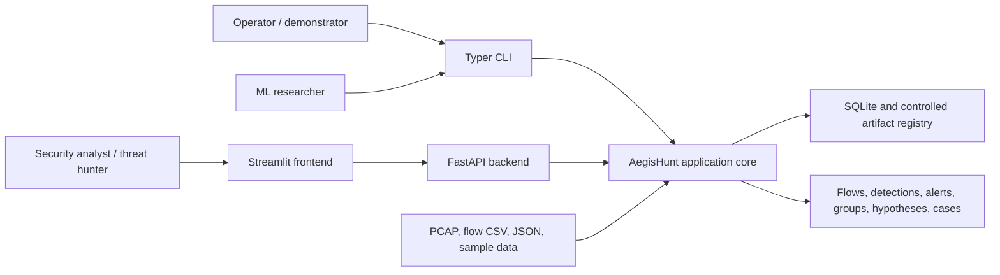
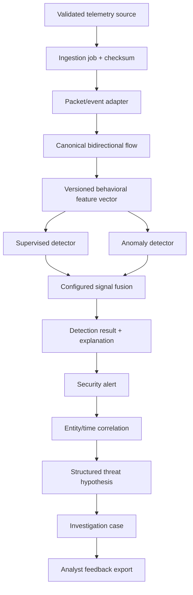

```mermaid
flowchart LR
    Sources["Versioned source data"] --> Quality["Schema + quality + leakage checks"]
    Quality --> Split["Group/time-aware split manifests"]
    Split --> Train["Candidate training with fixed seeds"]
    Train --> Validate["Validation selection and thresholds"]
    Validate --> Freeze["Frozen bundle + hashes + model card"]
    Freeze --> Test["One-time final test evaluation"]
    Test --> Registry["Validated model registry entry"]
    Registry --> Activate["Explicit human activation"]
    Feedback["Exported analyst feedback"] --> Sources
```

# Architecture

## Status and scope

This document defines the target architecture and its phased realization. In
Phase 0, only the Python package, Typer CLI shell, FastAPI `/health` endpoint,
Streamlit foundation page, and engineering configuration exist. Storage,
telemetry, flows, features, ML, detection, correlation, hunting, cases, and
runtime workers remain planned for their roadmap phases.

## System context

Users interact through the CLI, HTTP API, or frontend. Offline inputs are the
default operational boundary. The system does not require a live target or an
external model service.

## Modular-monolith structure

One deployable Python application is divided by responsibility:

| Module boundary | Planned responsibility | First owning phase |
| --- | --- | --- |
| `config`, schemas, storage | Validated settings, entity contracts, repositories, audit | 1 |
| ingestion | Safe adapters and ingestion jobs | 2 |
| flows, features | Packet-to-flow state and deterministic feature registry | 3 |
| datasets | Registry, conversion, split, manifests, leakage and quality | 4 |
| ML supervised/anomaly/fusion/evaluation | Training, inference, thresholds, comparison | 5-7 |
| detection and explainability | Results, risk, alerts, reasons, explanations | 8 |
| correlation and hunting | Entity/time groups and deterministic hypotheses | 9 |
| cases and feedback | Investigation workflow and retraining candidates | 10 |
| runtime | Pipeline, worker, replay, health, graceful shutdown | 11 |
| API and frontend | Complete external workflows and sample demonstration | 12 |

Domain modules must not depend on Streamlit. FastAPI routes and the CLI call
application services; repositories isolate persistence; adapters isolate file,
packet, model, and UI concerns. This keeps unit testing possible without running
the whole application.

## Planned data flow

The flow will preserve IDs and provenance across each transition. Raw evidence,
model inference, fusion, correlation, and analyst judgment remain distinguishable.

## Planned ML lifecycle

Supervised candidates include baseline and tree/linear models; the selected
algorithm follows evidence. Isolation Forest learns a benign baseline. Fusion
weights and thresholds come from validation experiments. Model bundles reject
feature-schema or integrity mismatch. No online self-modification occurs.

## Planned threat-hunting lifecycle

1. **Observe:** safely ingest or replay telemetry.
2. **Detect:** run supervised, anomaly, and optional deterministic signals.
3. **Explain:** retain observed values, references, contributions, and reason codes.
4. **Correlate:** group alerts by time and shared entities under configured rules.
5. **Hypothesize:** select deterministic templates and attach supporting and
   alternative evidence without marking an attack confirmed.
6. **Investigate:** create cases, notes, evidence references, status, and verdict.
7. **Learn under control:** export feedback, explicitly retrain, validate a new
   immutable version, and explicitly activate it.

## Backend and frontend relationship

FastAPI is the authoritative programmatic boundary. Streamlit will consume API
contracts rather than access the database or model artifacts directly. This
supports independent API tests, explicit validation, and future replacement of
the demonstration UI. The CLI can launch each shell and will later call the same
application services for batch workflows. In Phase 0, Streamlit is a truthful
static status shell and FastAPI exposes only `/health`.

## Planned storage approach

SQLite with SQLAlchemy and WAL mode is the default local store beginning in
Phase 1. Repository interfaces will prevent SQL from leaking into business
logic and preserve a future PostgreSQL migration path. The database will store
metadata, flows, detection records, alerts, groups, hypotheses, cases, feedback,
model versions, job state, and audit events as they are introduced.

Large or generated material stays outside source control:

- original and derived telemetry under `data/` with manifests and checksums;
- immutable model and evaluation bundles under `artifacts/`;
- human-readable experiment output under `reports/`.

The controlled model registry will verify schema and hashes before loading; user
uploads can never be treated as arbitrary serialized Python models.

## Deployment and trust boundaries

Local Python is the Phase 0 execution mode. Docker and Docker Compose are Phase
14 deliverables. Default listeners bind to loopback. Inputs cross an untrusted
file/API boundary and require validation before persistence or parsing. The
system performs observation and recommendation only: it does not scan targets,
execute attacks, modify firewalls, disable accounts, or run arbitrary commands.
