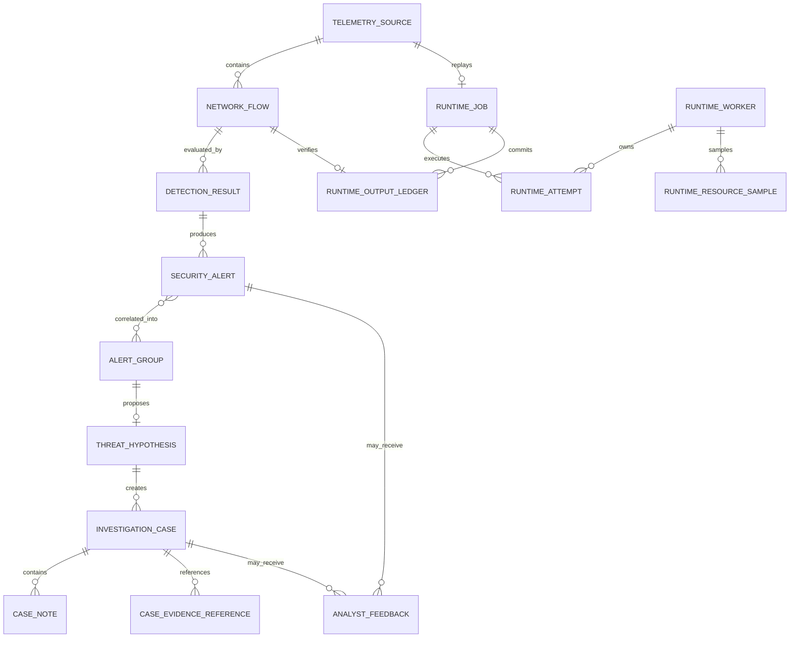

# AegisHunt Data and Artifact Model Through Phase 11

## Scope

Phase 1 defined core contracts and tables. Phase 2 persists telemetry lifecycles,
Phase 3 creates canonical `NetworkFlow` rows, Phase 4 adds file-based canonical
dataset/manifests, Phases 5–6 add controlled model/evidence bundles, and Phase 7
adds a JSON-only fusion-policy/evaluation artifact. Phase 8 extends the existing
`DetectionResult` and `SecurityAlert` foundations, persists complete score/risk
identity, creates threshold-gated alerts, explains results, and audits verdicts.
Phase 9 extends the existing `AlertGroup` and `ThreatHypothesis` foundations with
versioned correlation, evidence, provenance, templates, and audited safe status.
Phase 10 implements investigation cases, notes, typed evidence references,
analyst feedback, controlled exports, and explicit retraining-candidate
artifacts. Phase 11 adds durable runtime job, attempt, worker, resource-sample,
and output-ledger records without changing the evidence contracts of Phases 3–9.

## Contract layers

1. Pydantic schemas reject unknown fields and invalid identifiers, timestamps,
   addresses, ports, counts, scores, and state values.
2. SQLAlchemy records map contracts to portable relational tables.
3. Typed repositories provide add/get/list operations without exposing SQL to
   business modules.
4. Audit records are appended in the caller's transaction for repository writes.

All persisted timestamps are timezone-aware and normalized to UTC. SQLite may
return naive values, so the storage type restores UTC awareness on reads.

## Core entities

| Entity | Primary identifier | Key relationships and integrity rules |
| --- | --- | --- |
| `TelemetrySource` | `source_id` UUID | Source type, ingestion mode/status, timestamps, non-negative count, optional SHA-256, JSON metadata |
| `NetworkFlow` | `flow_id` UUID | Foreign key to source; first-observed direction; aware ordered timestamps; valid IPs/ports; non-negative counts; flat finite numeric features |
| `DetectionResult` | `detection_id` UUID | Foreign key to flow; engine/fusion scores and thresholds; risk source/score/severity; model/policy versions and checksums; feature schema; reasons; explanation; detection time |
| `SecurityAlert` | `alert_id` UUID | Foreign key to detection; configured risk/severity; immutable entities/evidence/reasons/explanation/identities; status; nullable verdict; created/updated times |
| `AlertGroup` | `group_id` UUID | Stable policy/member identity; ordered alert IDs; canonical entities; rule versions/evidence; bounded score components; observed event window; independent lifecycle creation time; triage severity; policy checksum |
| `ThreatHypothesis` | `hypothesis_id` UUID | Foreign key to group; deterministic template/candidates; facts/inferences/assumptions/alternatives; possible mappings; non-executed queries; bounded confidence components; independent created/updated lifecycle times; default `proposed` |
| `InvestigationCase` | `case_id` UUID | Foreign key to one eligible primary hypothesis; deterministic policy identity; priority/status, assignment, immutable initial evidence snapshot, nullable analyst verdict, lifecycle timestamps |
| `CaseNote` | `note_id` UUID | Foreign key to case; append-only actor/text/time evidence; no update/delete repository operation |
| `CaseEvidenceReference` | `reference_id` UUID | Foreign key to case; typed hypothesis/group/alert/detection/flow reference plus validated snapshot and provenance |
| `AnalystFeedback` | `feedback_id` UUID | Typed case/alert object reference, controlled revisable verdict, bounded confidence, actor, provenance, correction reason, created/updated times |
| `RuntimeJob` | `job_id` UUID | One job per completed PCAP source; pinned verified snapshot; controlled lifecycle, lease owner/expiry, committed progress/counters, safe failure |
| `RuntimeAttempt` | `attempt_id` UUID | Foreign key to job; worker/execution identity, origin-replay number, lifecycle times, outcome and safe error |
| `RuntimeWorker` | bounded string `worker_id` | Process identity, current job, heartbeat/lease status, lifecycle state, sanitized error |
| `RuntimeResourceSample` | `sample_id` UUID | Foreign key to worker and optional job; bounded CPU/RSS/thread observations plus queue/heartbeat state, or explicit unavailable/null semantics |
| `RuntimeOutputLedger` | `ledger_id` UUID | Unique job/flow output identity; flow/detection/optional-alert references and checksums used to verify origin-replay reuse |
| `ModelVersion` | `model_id` UUID | Type/version uniqueness, algorithm, feature/data/config/metric metadata, controlled artifact path, status; no model binary is loaded |
| `AuditEvent` | `audit_id` UUID | Actor, action, object reference, safe JSON details, UTC timestamp; repository exposes no update/delete method |

Variable structured evidence and lists use SQL JSON columns. This is appropriate
for the local prototype where their internal shape evolves in later phases.
Frequently filtered identifiers, statuses, severities, entities, and timestamps
remain relational columns with indexes. Large telemetry, datasets, model files,
and reports remain controlled filesystem artifacts referenced by metadata.

## Phase 4–11 artifact integrity

- Canonical datasets keep the fixed Phase 3 feature order separate from source,
  group, session, scenario, timestamp, provenance, and label metadata.
- Dataset/split manifests and quality/leakage reports bind checksums, identities,
  and group-exclusive partitions before a model can fit.
- Supervised and anomaly bundles are independently versioned exact-inventory
  artifacts. Their loaders verify configured-root containment, checksums, schema,
  estimator types, and version identity before prediction.
- The Phase 7 fusion policy contains no estimator binary. Its manifest binds the
  supervised/anomaly IDs and score semantics, feature schema, candidate and
  selected weights, selected threshold, FPR ceiling, recommendation, evidence
  hashes, environment, protocol/creation times, and experimental claim boundary.
- The policy directory has exactly a manifest, checksum inventory, and card.
  Missing, extra, corrupt, escaped, or colliding versions fail closed.
- A pure fusion output remains an ephemeral typed result. Phase 8 persists a
  separate identity-verified `DetectionResult` only after the configured risk
  policy accepts all upstream identities. A resulting alert is evidence for
  review, never a confirmed attack.
- The Phase 8 explanation artifact is data-only with an exact seven-file
  manifest/checksum inventory. It binds benign training references, supported
  native importance, fixed-validation permutation importance, reason catalog,
  model/policy identities, feature schema, and non-causal protocol.
- Phase 9 stores no model artifact. Its exact policy bytes are checksummed into
  every group/hypothesis, source alert evidence is snapshotted rather than mutated,
  structured investigation queries remain marked `not_executed`, and direct
  hypothesis confirmation is prohibited.
- Phase 9 separates observed event time from record lifecycle time. Group and
  hypothesis generation use injectable UTC clocks, structured evidence retains the
  generation timestamps, stable identities exclude wall-clock values, and
  idempotent reruns preserve the original persisted creation time.
- Phase 10 feedback exports, retraining-candidate artifacts, and case reports use
  configured contained roots, atomic exact-inventory writes, SHA-256 manifests,
  and collision rejection. Candidate rows come only from explicit alert feedback
  with an unambiguous alert→detection→flow chain and approved non-evaluation
  provenance. Case verdicts are never fanned out to member flows.
- Phase 11 pins the completed source checksum, logical stored filename, verified
  artifact IDs/versions/checksums, schema versions, runtime-policy checksum, and
  capture session. Absolute artifact paths are not persisted. Before the first
  packet, all pinned bytes and identities are revalidated; drift fails closed.

## Phase 3 flow integrity

- `source_id` identifies the durable ingestion source and its checksum/storage provenance.
- `capture_session_id` identifies the source-scoped offline processing session.
- `source_*` and `destination_*` preserve the first decoded packet direction,
  independently of canonical-key endpoint sorting.
- Duration must equal `last_seen - first_seen` and cannot be negative.
- Feature values are flat integers/floats and must be finite; strings, booleans,
  nested structures, NaN, and Infinity are rejected.
- Feature names/order come from registry version `1.0.0`. The source metadata
  records that version so no extra database column or migration is required.
- Flow UUIDs are deterministic inside a source namespace from key, segment,
  and time bounds. Re-ingesting the same bytes creates a new source and therefore
  new source-scoped IDs while retaining equivalent flow evidence/features.

## Relationships

Alert-group membership remains an ordered explicit alert-ID list because SQLite
is the local prototype store. Phase 9 services validate referenced alert evidence
before one transactional group write. Hypotheses add a nullable group foreign key
for backward-compatible migration and retain a complete immutable group snapshot.
Phase 10 service boundaries validate referenced evidence and use repository
transactions for each lifecycle mutation plus its audit record. Typed references
and snapshots do not modify the underlying hypothesis, group, alert, detection,
or flow evidence.

Phase 11 job claim is an atomic conditional update. Heartbeats, progress, and
resource samples use dedicated bounded records instead of audit-event spam.
One output batch commits the deterministic flow reuse/create, detection,
optional alert, ledger, counters, and progress together. Recovery never deletes
committed outputs: it starts from origin and accepts only checksum-equivalent
ledger evidence.

## Schema version

`schema_versions` records ordered integer versions and UTC application times.
Fresh initialization records version `5`. Existing supported version-1 through
version-4 SQLite databases are upgraded additively through ordered migrations
and retain all version records and existing rows. Repeated initialization is idempotent. Unknown versions,
unversioned non-empty databases, and unsupported migration dialects fail closed.
No destructive or rollback-by-deletion migration is attempted.

## SQLite behavior

- WAL is requested for file-backed SQLite databases.
- Foreign keys are enabled for each connection.
- Busy timeout is bounded and configuration-controlled.
- The configured database parent directory is created when needed.
- Initialization and repository tests use temporary databases; no database is committed.

## Audit boundary

Repository creates can receive an actor and append an `AuditEvent` in the same
transaction. Failed transactions therefore do not leave a misleading audit event.
Audit details must not contain secrets, raw credentials, or unbounded telemetry.
