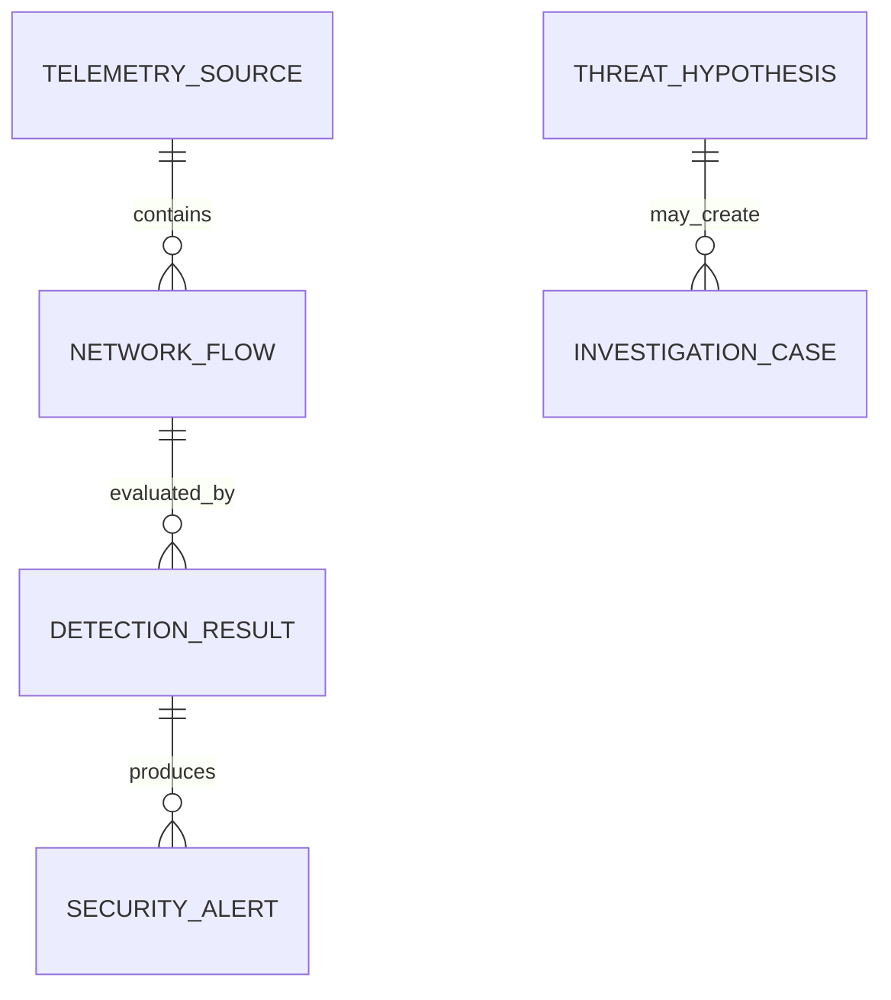

# Phase 1 Data Model

## Scope

Phase 1 defines validated contracts and persistence for the Project Plan's core
entities. It does not ingest telemetry, construct flows, run models, create
alerts, correlate events, generate hypotheses, or manage investigations. Later
services must enter through these schemas and repositories.

## Contract layers

1. Pydantic schemas reject unknown fields and invalid identifiers, timestamps,
   addresses, ports, counts, scores, and state values.
2. SQLAlchemy records map contracts to portable relational tables.
3. Typed repositories provide add/get/list operations without exposing SQL to
   business modules.
4. Audit records are appended in the caller's transaction for repository writes.

All persisted timestamps are timezone-aware and normalized to UTC. SQLite may
return naive values, so the storage type restores UTC awareness on reads.

## Core entities

| Entity | Primary identifier | Key relationships and integrity rules |
| --- | --- | --- |
| `TelemetrySource` | `source_id` UUID | Source type, ingestion mode/status, timestamps, non-negative count, optional SHA-256, JSON metadata |
| `NetworkFlow` | `flow_id` UUID | Foreign key to source; aware ordered timestamps; valid IPs/ports; non-negative packet/byte counts; JSON behavioral features |
| `DetectionResult` | `detection_id` UUID | Foreign key to flow; declared score ranges; model-version references; explanation JSON; detection time |
| `SecurityAlert` | `alert_id` UUID | Foreign key to detection; severity/status; involved entities, evidence, and reason codes |
| `AlertGroup` | `group_id` UUID | Referenced alert IDs, entity keys, bounded correlation score, ordered time window, summary |
| `ThreatHypothesis` | `hypothesis_id` UUID | Structured evidence and uncertainty; category/mappings are possible, not confirmed; default status is `proposed` |
| `InvestigationCase` | `case_id` UUID | Optional foreign key to hypothesis; priority/status, assignment, evidence, notes, related objects, verdict, ordered timestamps |
| `AnalystFeedback` | `feedback_id` UUID | Object reference, controlled verdict, bounded confidence, notes, audit time |
| `ModelVersion` | `model_id` UUID | Type/version uniqueness, algorithm, feature/data/config/metric metadata, controlled artifact path, status; no model binary is loaded |
| `AuditEvent` | `audit_id` UUID | Actor, action, object reference, safe JSON details, UTC timestamp; repository exposes no update/delete method |

Variable structured evidence and lists use SQL JSON columns. This is appropriate
for the local prototype where their internal shape evolves in later phases.
Frequently filtered identifiers, statuses, severities, entities, and timestamps
remain relational columns with indexes. Large telemetry, datasets, model files,
and reports remain controlled filesystem artifacts referenced by metadata.

## Relationships

Alert-group membership, hypothesis evidence, case evidence, and analyst feedback
references intentionally remain explicit ID lists or typed object references in
Phase 1. Later services own validation that referenced objects satisfy their
workflow-specific rules.

## Schema version

`schema_versions` records integer version `1` and its UTC application time.
Initialization is idempotent: missing tables and version `1` are created, while a
database whose highest version differs from the supported version is rejected.
No automatic destructive migration is attempted.

The Phase 1 approach is deliberately smaller than a full migration framework.
Before the first schema-changing phase, add an ordered migration mechanism and
advance the version only after forward and rollback behavior is tested.

## SQLite behavior

- WAL is requested for file-backed SQLite databases.
- Foreign keys are enabled for each connection.
- Busy timeout is bounded and configuration-controlled.
- The configured database parent directory is created when needed.
- Initialization and repository tests use temporary databases; no database is committed.

## Audit boundary

Repository creates can receive an actor and append an `AuditEvent` in the same
transaction. Failed transactions therefore do not leave a misleading audit event.
Audit details must not contain secrets, raw credentials, or unbounded telemetry.
