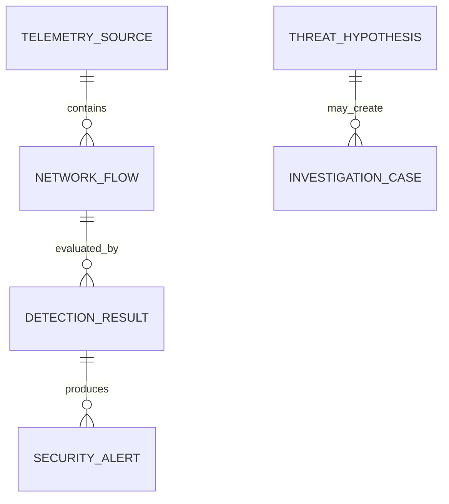

# AegisHunt Data and Artifact Model Through Phase 8

## Scope

Phase 1 defined core contracts and tables. Phase 2 persists telemetry lifecycles,
Phase 3 creates canonical `NetworkFlow` rows, Phase 4 adds file-based canonical
dataset/manifests, Phases 5–6 add controlled model/evidence bundles, and Phase 7
adds a JSON-only fusion-policy/evaluation artifact. Phase 8 extends the existing
`DetectionResult` and `SecurityAlert` foundations, persists complete score/risk
identity, creates threshold-gated alerts, explains results, and audits alert
verdicts. It does not correlate evidence, create hypotheses, or open
investigations.

## Contract layers

1. Pydantic schemas reject unknown fields and invalid identifiers, timestamps,
   addresses, ports, counts, scores, and state values.
2. SQLAlchemy records map contracts to portable relational tables.
3. Typed repositories provide add/get/list operations without exposing SQL to
   business modules.
4. Audit records are appended in the caller's transaction for repository writes.

All persisted timestamps are timezone-aware and normalized to UTC. SQLite may
return naive values, so the storage type restores UTC awareness on reads.

## Core entities

| Entity | Primary identifier | Key relationships and integrity rules |
| --- | --- | --- |
| `TelemetrySource` | `source_id` UUID | Source type, ingestion mode/status, timestamps, non-negative count, optional SHA-256, JSON metadata |
| `NetworkFlow` | `flow_id` UUID | Foreign key to source; first-observed direction; aware ordered timestamps; valid IPs/ports; non-negative counts; flat finite numeric features |
| `DetectionResult` | `detection_id` UUID | Foreign key to flow; engine/fusion scores and thresholds; risk source/score/severity; model/policy versions and checksums; feature schema; reasons; explanation; detection time |
| `SecurityAlert` | `alert_id` UUID | Foreign key to detection; configured risk/severity; immutable entities/evidence/reasons/explanation/identities; status; nullable verdict; created/updated times |
| `AlertGroup` | `group_id` UUID | Referenced alert IDs, entity keys, bounded correlation score, ordered time window, summary |
| `ThreatHypothesis` | `hypothesis_id` UUID | Structured evidence and uncertainty; category/mappings are possible, not confirmed; default status is `proposed` |
| `InvestigationCase` | `case_id` UUID | Optional foreign key to hypothesis; priority/status, assignment, evidence, notes, related objects, verdict, ordered timestamps |
| `AnalystFeedback` | `feedback_id` UUID | Object reference, controlled verdict, bounded confidence, notes, audit time |
| `ModelVersion` | `model_id` UUID | Type/version uniqueness, algorithm, feature/data/config/metric metadata, controlled artifact path, status; no model binary is loaded |
| `AuditEvent` | `audit_id` UUID | Actor, action, object reference, safe JSON details, UTC timestamp; repository exposes no update/delete method |

Variable structured evidence and lists use SQL JSON columns. This is appropriate
for the local prototype where their internal shape evolves in later phases.
Frequently filtered identifiers, statuses, severities, entities, and timestamps
remain relational columns with indexes. Large telemetry, datasets, model files,
and reports remain controlled filesystem artifacts referenced by metadata.

## Phase 4–8 artifact integrity

- Canonical datasets keep the fixed Phase 3 feature order separate from source,
  group, session, scenario, timestamp, provenance, and label metadata.
- Dataset/split manifests and quality/leakage reports bind checksums, identities,
  and group-exclusive partitions before a model can fit.
- Supervised and anomaly bundles are independently versioned exact-inventory
  artifacts. Their loaders verify configured-root containment, checksums, schema,
  estimator types, and version identity before prediction.
- The Phase 7 fusion policy contains no estimator binary. Its manifest binds the
  supervised/anomaly IDs and score semantics, feature schema, candidate and
  selected weights, selected threshold, FPR ceiling, recommendation, evidence
  hashes, environment, protocol/creation times, and experimental claim boundary.
- The policy directory has exactly a manifest, checksum inventory, and card.
  Missing, extra, corrupt, escaped, or colliding versions fail closed.
- A pure fusion output remains an ephemeral typed result. Phase 8 persists a
  separate identity-verified `DetectionResult` only after the configured risk
  policy accepts all upstream identities. A resulting alert is evidence for
  review, never a confirmed attack.
- The Phase 8 explanation artifact is data-only with an exact seven-file
  manifest/checksum inventory. It binds benign training references, supported
  native importance, fixed-validation permutation importance, reason catalog,
  model/policy identities, feature schema, and non-causal protocol.

## Phase 3 flow integrity

- `source_id` identifies the durable ingestion source and its checksum/storage provenance.
- `capture_session_id` identifies the source-scoped offline processing session.
- `source_*` and `destination_*` preserve the first decoded packet direction,
  independently of canonical-key endpoint sorting.
- Duration must equal `last_seen - first_seen` and cannot be negative.
- Feature values are flat integers/floats and must be finite; strings, booleans,
  nested structures, NaN, and Infinity are rejected.
- Feature names/order come from registry version `1.0.0`. The source metadata
  records that version so no extra database column or migration is required.
- Flow UUIDs are deterministic inside a source namespace from key, segment,
  and time bounds. Re-ingesting the same bytes creates a new source and therefore
  new source-scoped IDs while retaining equivalent flow evidence/features.

## Relationships

Alert-group membership, hypothesis evidence, case evidence, and analyst feedback
references intentionally remain explicit ID lists or typed object references in
Phase 1. Later services own validation that referenced objects satisfy their
workflow-specific rules.

## Schema version

`schema_versions` records ordered integer versions and UTC application times.
Fresh initialization records version `2`. An existing supported version-1 SQLite
database is upgraded additively to version 2 and retains both version records and
all existing rows. Repeated initialization is idempotent. Unknown versions,
unversioned non-empty databases, and unsupported migration dialects fail closed.
No destructive or rollback-by-deletion migration is attempted.

## SQLite behavior

- WAL is requested for file-backed SQLite databases.
- Foreign keys are enabled for each connection.
- Busy timeout is bounded and configuration-controlled.
- The configured database parent directory is created when needed.
- Initialization and repository tests use temporary databases; no database is committed.

## Audit boundary

Repository creates can receive an actor and append an `AuditEvent` in the same
transaction. Failed transactions therefore do not leave a misleading audit event.
Audit details must not contain secrets, raw credentials, or unbounded telemetry.
