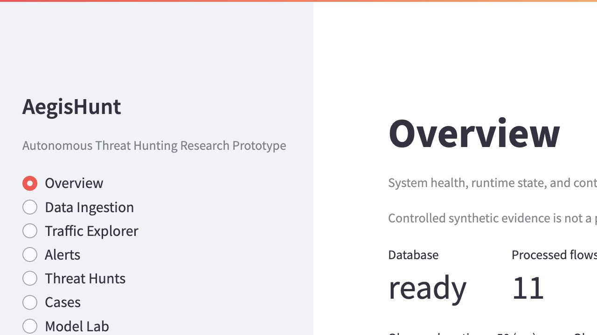
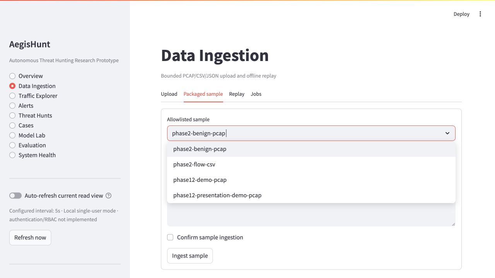
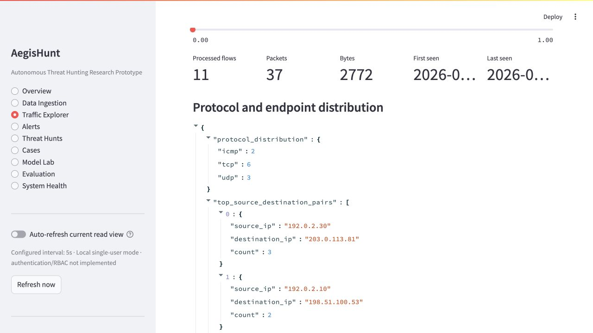
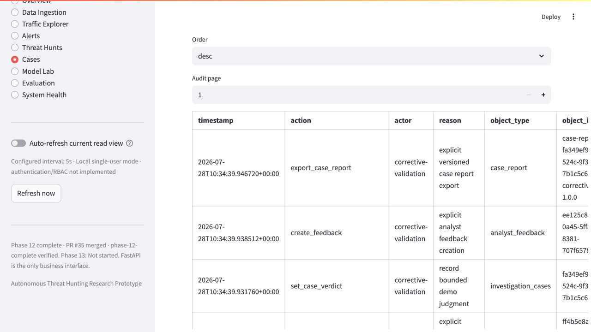
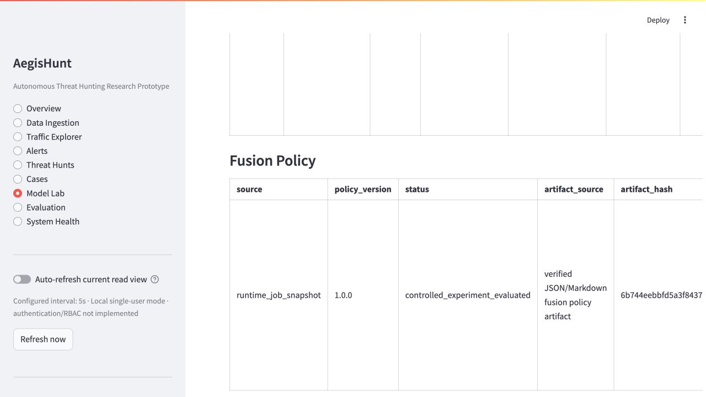
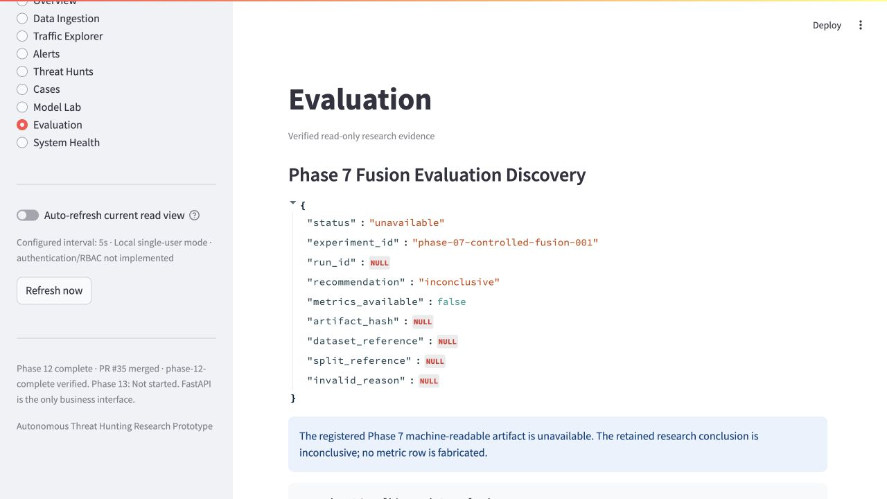
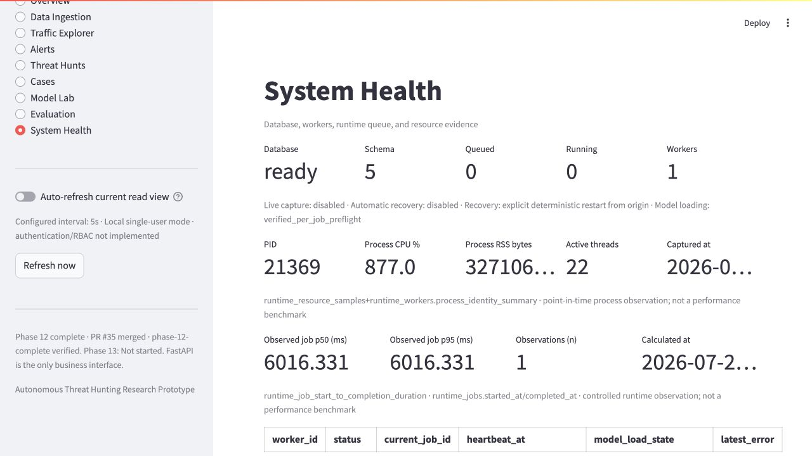

# Phase 12 Demo Readiness Corrective Validation

## 1. Scope

This corrective change addresses only the presentation, state-wiring, basic
runtime-observation, case-audit, and controlled-presentation-sample limitations
found during the Phase 0–12 demonstration validation. It does not start Phase
13, alter a frozen research result, retrain a model, change a threshold or
fusion weight, run a load/stress/security scan, or claim production readiness.

Precondition evidence:

- validation PR
  [#37](https://github.com/SaXingrui-UM/aegishunt/pull/37) was merged into
  `main` as `a10040de971154023a7ef35b6ebbcb000e27c6bc`;
- `main` was clean and synchronized with `git pull --ff-only`;
- work was isolated on `fix/phase-12-demo-readiness-limitations`.

The corrective validation used
`.tmp/demo-readiness-corrective/20260728T103124Z/` and a new SQLite database.
The historical `docs/phase-00-12-demo-validation.md` evidence was not changed.

## 2. Original limitations

| Limitation | Corrective status | Decision |
| --- | --- | --- |
| Global active and runtime-pinned effective models were conflated | RESOLVED | Added an effective runtime read model and separate UI sections without changing global pointers |
| Model Lab did not show the policy actually used by fusion | RESOLVED | Exposed the verified policy from configured/runtime snapshot sources as a policy, not an sklearn model |
| Phase 7 fusion evaluation appeared as a generic unavailable row | PARTIALLY RESOLVED | Added strict discovery and a typed status; the registered machine-readable Phase 7 artifact is absent from this checkout |
| Current Demo Run latency/resource observations were not visible | RESOLVED | Exposed measured job duration and persisted process resource observations with source, `n`, and benchmark caveats |
| Cases did not expose persisted audit history | RESOLVED | Added a bounded read-only API, typed client, and Audit History tab |
| Presentation sample was too small and lacked IPv6/ICMP | RESOLVED | Preserved the five-packet fixture and added a deterministic 32-packet presentation sample |
| Recovery is not exact packet-cursor resume | INTENTIONALLY RETAINED | Existing deterministic restart-from-origin semantics remain unchanged |
| LOF/fusion research limitations require new independent evidence | RESEARCH LIMITATION / DEFERRED TO PHASE 13 | No holdout reuse, retraining, tuning, or conclusion change was performed |

## 3. Resolution decision for each limitation

The six in-scope product/readiness items were resolved where evidence exists.
Phase 7 discovery is only partial: the product now distinguishes an unavailable
artifact from an inconclusive result and reports every missing entry, but it
does not manufacture metrics from release prose or two-flow Demo evidence.
Exact cursor recovery and new robustness/research experiments remain out of
scope.

## 4. Effective model semantics

`GET /models/active` remains the global-pointer API and returned `[]` in the
fresh run. `GET /models/effective` returned the latest completed runtime job
`22d169eb-1c87-4218-9f3d-508061e7584e` and its immutable snapshot:

| Engine | Algorithm/version | Registry status | Source | Global pointer |
| --- | --- | --- | --- | --- |
| supervised | Random Forest `12.0.0` | `verified` | `runtime_job_snapshot` | `false` |
| anomaly | Local Outlier Factor `1.1.0-candidate` | `validation_qualified` | `runtime_job_snapshot` | `false` |

The response also carries feature-schema version, artifact hash, threshold,
snapshot timestamp, qualification, and limitations. The LOF candidate is
explicitly not activation-eligible because there is no untouched independent
holdout. Runtime execution did not silently mutate global state.

## 5. Fusion policy visibility

The latest runtime snapshot exposed policy `phase12-controlled-demo-fusion`
version `1.0.0`, artifact SHA-256
`6b744eebbfd5a3f843731f39c4d2d478491e2651fe62d1c82cf939ad4855e65c`,
supervised weight `0.75`, anomaly weight `0.25`, threshold `0.7`, and feature
schema `1.0.0`. The values are read from verified runtime artifact data; they
are not UI constants. The policy is represented separately from models and is
labelled `controlled_experiment_evaluated`, with recommendation
`inconclusive`.

There was no separate configured global policy in this isolated Demo
environment, so the API returned a typed `null` configured policy and the
effective runtime policy. If both sources exist, the contract exposes both.

## 6. Phase 7 evaluation discovery

The unavailable row was caused by absent registered machine-readable
experiment/policy artifacts, not by the word `inconclusive`. A strict adapter
now validates the experiment inventory, schema, version match, checksums,
dataset/split references, known/unseen-family results, comparison results, and
confidence intervals before publishing a fusion evaluation row.

For this checkout, `GET /evaluation/fusion-status` returned:

- `status=unavailable`;
- `metrics_available=false`;
- `experiment_id=phase-07-controlled-fusion-001`;
- `recommendation=inconclusive`;
- 21 exact missing artifact entries: 18 experiment files and three
  version-matching policy files.

No fake fusion row was returned, no Demo metric was promoted into research
evidence, and no frozen experiment was rerun. Release metadata retains the
truthful conclusion that fusion was not shown superior to supervised-only,
LOAO fusion was weaker than anomaly-only, and held-out exfiltration and
reconnaissance misses remain.

## 7. Runtime observability definition

The observed latency metric is
`runtime_job_start_to_completion_duration`, calculated from persisted
`runtime_jobs.started_at` and `runtime_jobs.completed_at`. It never subtracts a
historical packet timestamp from the current wall clock.

For presentation job `22d169eb-1c87-4218-9f3d-508061e7584e`:

- p50: `6016.331 ms`;
- p95: `6016.331 ms`;
- observation count: `n=1`;
- window: `2026-07-28T10:34:40.088317Z` through
  `2026-07-28T10:34:46.104648Z`;
- source: `runtime_jobs.started_at/completed_at`.

The resource snapshot was captured at `2026-07-28T10:34:46.106814Z`:

- PID `21369`;
- process CPU `877.0%` (a point-in-time multi-core process observation);
- RSS `327106560` bytes;
- active threads `22`;
- source:
  `runtime_resource_samples+runtime_workers.process_identity_summary`.

Both responses state that these are controlled observations, not performance
benchmarks. Providers remain injectable, and missing data returns a typed
unavailable reason rather than zero.

## 8. Audit history

`GET /cases/{case_id}/audit-events` is read-only and supports bounded page,
page-size, exact action/actor filters, time range, and ascending/descending
order. Summaries are bounded and recursively redact secret-like fields; the API
does not accept SQL expressions, return raw unbounded blobs, or mutate history.

Case `fa349ef9-4dc5-524c-9f37-7b1c5c658826` returned seven records from the
same append-only audit table used by the write services:

- `create_case_from_hypothesis`;
- `update_case_status`;
- `add_case_note`;
- `create_feedback` for the note;
- `set_case_verdict`;
- `create_feedback` for analyst feedback;
- `export_case_report`.

## 9. Presentation sample

The original `data/sample/phase12-demo.pcap` remains 350 bytes and five packets
with unchanged SHA-256
`5275d1cd350072883d046cf5b4fe4a438d8ded69375241bbd94b90a21e8c4226`.

The new `data/sample/phase12-presentation-demo.pcap` is 3,580 bytes and 32
packets with SHA-256
`0d272ac98660eb119cded8be194a513c2db82b475d4cce982a120eb210a8ab51`.
Its checked-in generator and manifest make it deterministic and reproducible.
The packet inventory is IPv4 18, IPv6 14, TCP 20, UDP 8, ICMPv4 2, and ICMPv6
2. It contains controlled bidirectional DNS-like, web-like, repeated-short,
periodic-small, and asymmetric-transfer-like profiles using only RFC/IANA
documentation address ranges. It contains no real target, credential, exploit,
malware, flood, account, or domain and requires neither root nor a network.

All nine extracted flow feature vectors were finite. Reprocessing returned the
same source, runtime-job, flow, alert, group, and hypothesis identities.

## 10. API validation

Fresh API evidence was saved beneath
`.tmp/demo-readiness-corrective/20260728T103124Z/api/`. The run exercised the
health/system/runtime, sample/source/job, model/effective-model, fusion
discovery, flow/detection/alert, group/hypothesis, case/feedback/report/audit,
and controlled Demo routes. New routes were also verified in OpenAPI:

- `GET /models/effective`;
- `GET /evaluation/fusion-status`;
- `GET /cases/{case_id}/audit-events`.

## 11. Frontend validation

All nine Streamlit pages were opened in a real browser against the isolated
API/database. The final browser session had no console warnings or errors.

- Overview separated global and effective models and showed measured p50/p95,
  `n`, source, and caveat.
- Data Ingestion listed both Phase 12 samples and allowed selection of
  `phase12-presentation-demo-pcap`.
- Traffic Explorer showed 11 combined flows, 37 packets, protocol distribution
  `icmp=2`, `tcp=6`, `udp=3`, and IPv6 `2001:db8::/32` endpoints.
- Alerts and Threat Hunts showed the persisted downstream objects.
- Cases showed the read-only Audit History controls and seven persisted events.
- Model Lab showed global/effective models and the verified runtime Fusion
  Policy.
- Evaluation showed `unavailable` artifact evidence separately from the
  retained `inconclusive` recommendation.
- System Health showed PID, CPU, RSS, threads, capture time, p50/p95, `n`, and
  sources.

Selected current-run screenshots are committed under
`docs/evidence/phase-12-corrective/`.















## 12. Tests

Coverage includes:

- unit resolution of global versus runtime-pinned models, Fusion Policy
  mapping, activation eligibility, evaluation discovery, latency summary,
  injectable resource provider, audit filtering/pagination/redaction, and
  presentation packet inventory;
- integration of runtime snapshot to API/model views, strict Phase 7 artifact
  discovery, case audit API, runtime observations, and PCAP-to-flow/features;
- E2E of the original full lifecycle, effective model and policy APIs,
  append-only audit history, presentation ingestion/replay, deterministic
  repetition, and typed frontend client;
- frontend source/contract assertions for all corrected pages.

Final quality results:

- `ruff check .`: passed;
- `mypy src`: passed with no issues in 237 source files;
- final repository-wide `pytest`: 465 passed, zero failed/skipped/xfailed in
  1,557.83 seconds;
- branch-aware coverage: 85.39%, above the unchanged 85% gate;
- focused corrected E2E:
  `test_sample_demo_runs_full_existing_pipeline_idempotently` passed in 44.09
  seconds.

The required `codex review --base main` attempt could not start because the
packaged native executable was missing:

```text
Error: spawn /Users/yuxiaoxing/.nvm/versions/node/v22.22.1/lib/node_modules/@openai/codex/node_modules/@openai/codex-darwin-arm64/vendor/aarch64-apple-darwin/codex/codex ENOENT
```

The equivalent read-only `main...HEAD` review covered correctness, security,
requirements, test evidence, accidental secrets, generated/oversized files,
data and evaluation integrity, hard-coded metrics or policy values, and Phase
13 scope. It found zero unresolved Blocking, High, or Medium findings.

The first focused run exposed one stale new-test expectation of one
presentation group/hypothesis while the unchanged real policy produced three
of each; the assertion was corrected to the independently recorded Demo/API
result. The first full run then passed 464 tests and exposed one status-document
regression where a historical Phase 12 PR sentence had been replaced; the
historical sentence was restored while retaining the additive corrective
status. No test was deleted, skipped, weakened, or excluded.

## 13. Resolved limitations

- Global active versus immutable job-pinned effective model visibility.
- Runtime Fusion Policy visibility without pretending it is an sklearn model.
- Basic measured Demo job latency and process-resource visibility.
- Bounded, read-only Case Audit History API/client/UI.
- Deterministic presentation telemetry with IPv4, IPv6, TCP, UDP, ICMPv4, and
  ICMPv6 coverage while retaining the original regression fixture.

## 14. Intentionally retained limitations

- Recovery remains deterministic restart from origin, not exact packet-cursor
  resume.
- The five-packet fixture remains the compact complete-lifecycle regression
  sample.
- The presentation sample is synthetic and controlled; it is not attack
  evidence or a benchmark.
- Local single-user/SQLite boundaries remain unchanged.

## 15. Deferred Phase 13 work

Formal p50/p95/p99 benchmarking, load/stress/capacity tests, robustness
experiments, dependency/security/secret scans, path-traversal review,
production hardening, and automatic recovery remain deferred. No Phase 13
branch or implementation was started.

## 16. Remaining research limitations

- Anomaly score is not attack probability.
- Fusion/risk score is not attack probability.
- A hypothesis is not a confirmed attack.
- MITRE mappings are possible mappings, not attribution.
- LOF remains validation-qualified and is not globally active.
- Fusion recommendation remains inconclusive.
- The registered Phase 7 machine-readable artifact is unavailable in this
  checkout, so real comparison metrics and confidence intervals cannot be
  rendered here.
- No zero-day detection claim is made.

## 17. Readiness decision

**READY WITH EXPLICIT RETAINED LIMITATIONS** for a controlled Phase 0–12
presentation, provided the Phase 7 pane is presented as typed artifact
unavailability with the retained inconclusive conclusion. This is not a
production-readiness, performance, security, or research-superiority decision.

## 18. Exact reproduction commands

From a clean checkout of the corrective branch:

```bash
python scripts/generate_phase12_presentation_pcap.py
sha256sum data/sample/phase12-demo.pcap \
  data/sample/phase12-presentation-demo.pcap

export AEGISHUNT_DATABASE__URL="sqlite:////absolute/path/to/corrective.db"
export AEGISHUNT_WEB__DEMO_ARTIFACT_ROOT=".tmp/demo-artifacts-corrective"
export AEGISHUNT_INGESTION__STORAGE_ROOT=".tmp/corrective-raw"
export AEGISHUNT_CASE_FEEDBACK__POLICY_PATH=".tmp/corrective-case-feedback.yaml"

PYTHONPATH=src python -m aegishunt.cli init-db
PYTHONPATH=src python -m aegishunt.cli demo run \
  --sample-id phase12-demo-pcap \
  --actor corrective-validation \
  --reason "fresh corrective lifecycle validation" \
  --create-case \
  --confirm
PYTHONPATH=src python -m aegishunt.cli demo run \
  --sample-id phase12-presentation-demo-pcap \
  --actor corrective-validation \
  --reason "fresh corrective presentation validation" \
  --confirm
PYTHONPATH=src python -m aegishunt.cli demo run \
  --sample-id phase12-presentation-demo-pcap \
  --actor corrective-validation \
  --reason "fresh corrective presentation validation" \
  --confirm

PYTHONPATH=src python -m aegishunt.cli api
AEGISHUNT_WEB__API_BASE_URL=http://127.0.0.1:8000 \
  PYTHONPATH=src python -m streamlit run src/aegishunt/frontend/app.py \
  --server.address=127.0.0.1 --server.port=8501 --server.headless=true

ruff check .
mypy src
pytest
```
