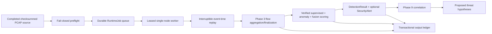

# Phase 11 Runtime Pipeline

## Scope

The Phase 11 runtime connects already implemented Phase 2–9 components. It does
not create Phase 12 HTTP workflows or frontend investigation pages, train or
activate models, scan a network, execute response actions, or accept a live
target.



## Verified preflight

Job creation accepts only a persisted telemetry-source UUID. Arbitrary runtime
paths are not accepted. The source must be complete, checksummed, PCAP-typed, and
stored as a regular non-symlink file inside the configured ingestion root. The
preflight uses existing exact-inventory loaders for:

- supervised model bundle;
- anomaly model bundle;
- fusion policy;
- risk policy;
- explanation artifact;
- correlation policy;
- fixed Phase 3 feature and flow configuration.

The pinned snapshot contains only a logical stored filename, never an absolute
path. It binds source and artifact checksums, all IDs/versions, feature schema,
runtime policy checksum, database schema, capture session, and available Git
commit. The worker repeats preflight before parsing and compares the complete
snapshot. Any drift fails before packet processing.

## Durable state

`RuntimeJob` states are:

```text
queued -> validating -> running -> completed
                         |  |
                         |  +-> pause_requested -> paused -> running
                         +----> failed
                         +----> recovery_pending -> queued (explicit recover)
```

Workers use an atomic conditional SQLite update to claim one oldest queued job.
A lease is renewed by heartbeat. Expired leases are reconciled to
`recovery_pending`; they are never silently requeued. Attempts preserve each
execution and record whether it completed, failed, paused, or was interrupted.

Only one runtime job may exist for one telemetry source. A duplicate create is
rejected with instructions to use explicit recovery. This prevents two jobs from
claiming the same deterministic flow/detection evidence.

## Transaction boundary

One output batch transaction contains:

1. deterministic flow reuse or create;
2. verified dual-engine scoring;
3. `DetectionResult`;
4. optional threshold-gated `SecurityAlert`;
5. `RuntimeOutputLedger`;
6. committed counters and progress.

A failure rolls back the entire batch. Progress never describes uncommitted
output. On origin replay after interruption, a matching ledger verifies the
stored flow/detection/alert checksum and counts it as reused. Missing or
different evidence fails closed.

EOF flushes only complete Phase 3 flow state. A shutdown does not flush partial
flow state because that would change deterministic segmentation. After all
batches commit, existing idempotent correlation and hypothesis services run in a
final transaction before the job becomes `completed`.

## Operator boundaries

- no root requirement;
- no live interface capture;
- no external network access or fixed target;
- no arbitrary command execution;
- no automatic recovery;
- no model training, activation, feedback, or Case creation;
- no Phase 12 complete API/frontend workflow.

The Streamlit shell reads bounded persisted queue/worker/resource state. If the
status store is unavailable it says so and does not fabricate zeros.
