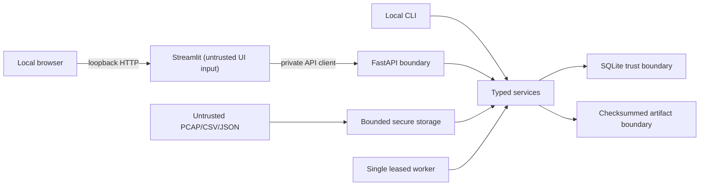

# Final threat model

## Scope, assets, and objectives

Scope is the local CLI, FastAPI, Streamlit, SQLite, one worker, untrusted
telemetry inputs, model/policy/data artifacts, evidence reports, audit log, and
Docker Compose delivery. Assets are source provenance, feature/detection
integrity, model/policy identity, frozen evidence, cases/feedback, audit
history, local availability, and analyst confidentiality.

Objectives are fail-closed parsing and artifact loading, bounded resource use,
exact evidence identity, local-only exposure, least container privilege,
sanitized errors, and explicit human control. Actor strings are audit labels,
not authentication.

## Trust assumptions and actors

The operator controls the local account, repository/release workspace, Docker
daemon, and configured writable roots. A same-user filesystem actor is a
powerful precondition and remains a residual risk. Threat actors include a
malicious upload/API client, poisoned data/model producer, compromised local
account/dependency/image, accidental operator, and resource-exhaustion input.

## Entry points and abuse cases

| Boundary | Threat | Current controls | Residual risk |
| --- | --- | --- | --- |
| Upload | traversal, extension spoofing, malformed lengths, archive/resource exhaustion | basename and type/content validation, bounded chunks/records/depth/packet lengths, safe storage, transaction failure | CPU/disk exhaustion within configured bounds |
| Loopback API | CSRF/CORS, unauthorized mutation, oversized bodies, error leakage | explicit local origins, body limits, typed confirmation, request IDs, sanitized handlers | no authentication/RBAC; malicious local web origin remains relevant |
| Artifacts | substitution, symlink/TOCTOU, extra/missing file, unsafe pickle | configured-root containment, no symlink, exact inventory, SHA-256, `skops` type allowlist, identity/version collision rejection | same-user root replacement and unsigned distribution |
| ML/evidence | poisoning, leakage, test reuse, feedback poisoning | group/leakage gates, train/validation/test separation, frozen identity, provenance filtering, explicit retraining candidate only | controlled data, noisy analyst judgment, no external validation |
| SQLite | contention, corruption, total outage | WAL, FK, busy timeout, transactions, integrity checks, single worker | DEF-004 and no independent control plane/HA |
| Worker | lease theft, stale process, replay duplication | lease/heartbeat, preflight pinning, output ledger, explicit recovery, shutdown | restart-from-origin and local availability limits |
| Docker | image compromise, shared-volume tampering, breakout | non-root UID 10001, read-only root, capabilities dropped, no-new-privileges, dedicated bridge, loopback ports, no socket/host mounts | host Docker daemon trust, non-immutable base tag, and no Compose egress firewall |
| Logs/audit | secret/path/SQL leakage or deletion | sanitized messages, append-only repository APIs, bounded metadata | local owner can alter SQLite/files; no remote immutable audit sink |
| Response | autonomous harm | no live capture, query execution, blocking, remediation, or automatic response | analyst may misinterpret scores/hypotheses |

## Phase 13 ledger delivery assessment

The immutable 80-finding ledger contains 39 Accepted risk, 19 Deferred to Phase
14, and 13 Needs further validation entries (plus fixed/duplicate/not-reachable
dispositions). Phase 14 does not bulk-resolve them. Container non-root
permissions, loopback publication, read-only root, explicit volumes, release
inventory verification, package isolation, and truthful documentation mitigate
delivery exposure. Original ledger status remains historical; unresolved
finding-specific actions remain in
[`phase-13-security-findings.json`](../configs/hardening/phase-13-security-findings.json).

## Supply chain and secrets

The wheel/sdist and release directory have checksummed inventories. CI pins
actions by commit. The Docker base uses
`python:3.11.13-slim-bookworm`, not an invented digest. A mutable upstream tag,
package index, and Docker daemon remain trusted. No secret, `.env`, user DB,
formal model binary, or raw scan result is included. Runtime secrets are not an
implemented feature.

The formal exact-final-head Codex Security rescan was explicitly waived and was
not executed. Dependency audit, secret scan, Bandit, regression evidence, and
the immutable ledger are complementary controls, not a formal rescan or
substitute result.

## Out-of-scope production controls

Production deployment needs authentication/authorization, TLS and CSRF design,
per-user tenancy, signed/SBOM-attested images and packages, immutable image
digests, a dedicated database and durable queue, backup/restore, remote
immutable audit, rate limiting/WAF, secrets management, orchestration, network
policy, monitoring/alerting, incident response, external penetration testing,
privacy retention/deletion policy, and legal/licensing review.
